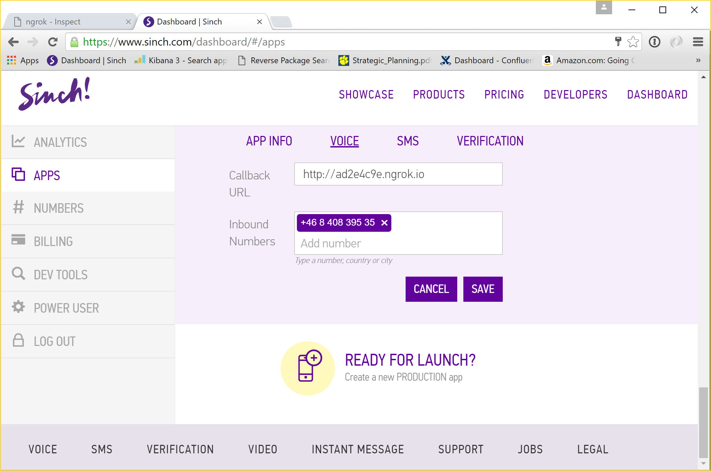

# Get your second number and test sinch Callbacks/webhooks with ngrok.

Today I will show how you can redirect a Sinch number to your own mobile number, having a few friends in Sweden (and my boss) I thought it would be cool to have a Swedish number that is redirected to my US mobile. I also wanted to show you the awesome tool ngrok.

One of the harder things when you do integration with webhooks/callbacks is that the remote server needs to be able to access your server, and usually you done have your dev server available as a webs server on the internet, so you have to rely on dynamic DNS or a similar solution. One awesome way to solve this is to use [ngrok](https://ngrok.com/ "ngrok"). It sets up a tunnel. It has an awesome other feature that enables you to see all requests and responses with data. 

## Getting started
In this example we are going to build a simple node app that will respond witch SVAML to connect any call to a number to my number here in SF. To read more about different events and what you can respond read the docs here
[http://sinch.com/docs/voice/rest](http://sinch.com/docs/voice/rest "SVAML") 

Create a file and call it app.js
```javascript
var http = require('http')

var server = http.createServer(function (request, response) {
    var data = '';
    request.on('data', function (chunk) {
        data += chunk;

    });
    request.on('end', function () {
        var requestModel;
        var responsedata;
        if (data == '') {
            response.writeHead(500, { 'Content-Type': 'application/json' });
            response.end('{"message":"no data posted"}');
            return;
        }
        requestModel = JSON.parse(data);
        response.writeHead(200, { 'Content-Type': 'application/json' });
        switch (requestModel.event) {
            case "ice":
                responsedata = {
                    instructions: [],
                    action: {
                        name: "connectpstn",
                        destination: {
                            type: "number",
                            endpoint: "+15612600684"
                        },
                        cli: "+15612600684",
                        maxDuration: 14400,
                        locale: "en-US"
                    }
                };
                break;
            case "ace":
                responsedata = {
                    "instructions": [],
                    "action": {
                        "name": "continue"
                    }
                };
                break;
            default:
                responsedata = {}
        }
        response.end(JSON.stringify(responsedata));
    }
    );
});
server.listen(5500);
```
As you see we just read the body of the request, look if its an incoming call (start of call) or if someone answered and reply with the correct action to connect the call. We start the server on port 5500.  

Before we continue, install ngrok https://ngrok.com/download its a one file app so no installer, unpack it to a folder of your choice (I love ngrok so i also put in in path so I use it easy anywhere). 

At least on windows, you need to terminals, one for node and one for ngrok,start your node app 
```bash
node app.js
```
start ngrok
```bash
ngrok http 5500
```
After starting ngrok you should see the dynamic domain name you where given, open a browser and point it to http://localhost:4040/ and you should see this. 

Take not of the url, before I will hook up a real phonenumber number in the sinch portal I want to make sample request to the url head over to http://svaml.net/simulator to simulate a incoming call event

Change the url to url from ngrok. hit test and you now you should see  in your http://localhost:4040/ what was posted to the server and what the respone was. In this case all was good so no problem there. But the awesome thing is when stuff dont work as you wanted. You can then use your favorite node debugger and step thru code from real integration traffic. 

## Wrapping up
To  wrap this baby up lets add a number to sweden as I mentioned in the beginning. 

To make this happen you need to have an application in the Sinch dashboard and a phone number (DM me @cjsinch if you need some more test credits) 
1. Rent a number with voice capability in the [rent number](https://www.sinch.com/dashboard/#/numbers) 
2. Go to your app [https://www.sinch.com/dashboard/#/apps](https://www.sinch.com/dashboard/#/apps) or create one if you dont have one. 
3. Configure teh voice tab by adding your newly rented number and add your ngrok url


Call the number and start seeing real live requests from the sinch plattform.


   
